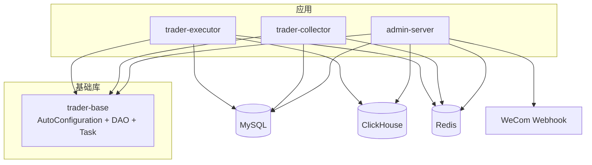
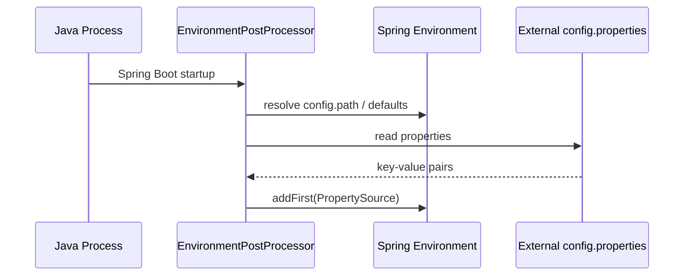
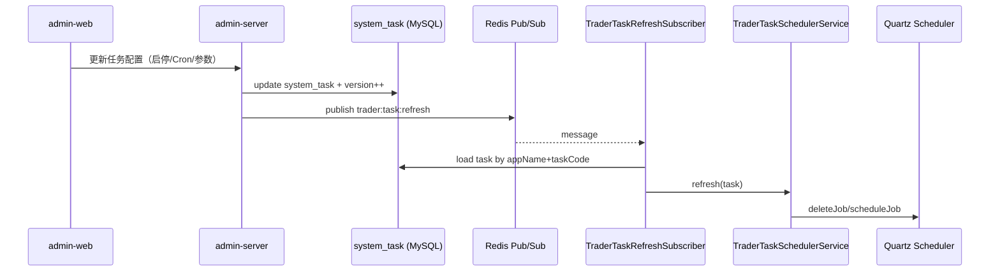

# 00 - 整体架构

## 仓库分层

- 基础设施层：`trader-base`（自动装配、数据源/Redis、任务抽象、任务日志、DAO 下沉）
- 业务服务层：
  - `trader-admin/admin-server`：管理端后端（提供管理 API、DB 初始化/升级、对外聚合查询）
  - `trader-collector`：采集/同步（对接外部数据源，写入库）
  - `trader-executor`：策略执行/节点（按策略生成交易、写日志并广播）
- 表现层：`trader-admin/admin-web`（Vue3 管理后台）

## 组件与数据存储

## 关键链路

### 1) 外部配置加载（通用）

各服务均支持通过外部 `config.properties` 注入配置（路径可通过启动参数覆盖），核心在 `EnvironmentPostProcessor` 阶段把属性源插入到最高优先级。

- `trader-base`：通过 [ConfigLoader](../../trader-base/src/main/java/cc/riskswap/trader/base/config/ConfigLoader.java#L19-L90) 加载
  - 默认路径：`/opt/trader/config.properties`
  - 运行时参数：`--config.path=...`，以及节点级：`--node.config.path=...`
- `trader-collector`：通过 [collector ConfigLoader](../../trader-collector/src/main/java/cc/riskswap/trader/collector/system/ConfigLoader.java#L17-L62) 加载
  - 默认路径：`/opt/fund/config.properties`
  - 支持环境变量：`CONFIG_PATH`

### 2) 统一数据访问（MySQL + ClickHouse + Redis）

`trader-base` 把多数据源与 Mapper 扫描做成自动装配，业务项目只需提供 `trader.mysql.*` / `trader.clickhouse.*` / `trader.redis.*` 配置即可启用。

- 数据源/SqlSessionFactory/SqlSessionTemplate：见 [TraderDataSourceAutoConfiguration](../../trader-base/src/main/java/cc/riskswap/trader/base/autoconfigure/TraderDataSourceAutoConfiguration.java#L27-L145)
- Redis 连接与 Topic 订阅：见 [TraderRedisAutoConfiguration](../../trader-base/src/main/java/cc/riskswap/trader/base/autoconfigure/TraderRedisAutoConfiguration.java#L24-L81)

### 3) 统一任务调度（Quartz + Redis Pub/Sub + 轮询兜底）

任务模块的代码位于 `trader-base/base/task`，其核心目标是：

- 业务服务通过实现 [TraderTask](../../trader-base/src/main/java/cc/riskswap/trader/base/task/TraderTask.java#L3-L18) 注册“任务定义”（code/name/cron/schema/execute）
- 系统通过 `system_task` 表（DAO：`SystemTaskDao`）存储“任务配置”（是否启用、cron、参数等）
- 当任务配置变更时，自动刷新 Quartz 中的 Job/Trigger（订阅 Redis Topic 或轮询检测 version 变化）

当前仓库状态下，任务的“调度注册与刷新”已具备：

- 任务扫描与注册表：`Spring -> List<TraderTask> -> TraderTaskRegistry`，见 [TraderTaskAutoConfiguration](../../trader-base/src/main/java/cc/riskswap/trader/base/autoconfigure/TraderTaskAutoConfiguration.java#L35-L39) 与 [TraderTaskRegistry](../../trader-base/src/main/java/cc/riskswap/trader/base/task/TraderTaskRegistry.java#L8-L28)
- Quartz 注册与刷新：见 [TraderTaskSchedulerService.refresh](../../trader-base/src/main/java/cc/riskswap/trader/base/task/TraderTaskSchedulerService.java#L24-L47)
- Redis 消息触发刷新：Topic `trader:task:refresh`，见 [TraderTaskRefreshPublisher](../../trader-base/src/main/java/cc/riskswap/trader/base/task/TraderTaskRefreshPublisher.java#L6-L18) 与 [TraderTaskRefreshSubscriber.handle](../../trader-base/src/main/java/cc/riskswap/trader/base/task/TraderTaskRefreshSubscriber.java#L20-L35)
- 轮询兜底刷新：见 [TraderTaskPoller.poll](../../trader-base/src/main/java/cc/riskswap/trader/base/task/TraderTaskPoller.java#L23-L32) 与 [TraderTaskPollingJob](../../trader-base/src/main/java/cc/riskswap/trader/base/task/TraderTaskPollingJob.java#L13-L16)

需要注意：Quartz Job 的执行代理 [TraderQuartzJob.execute](../../trader-base/src/main/java/cc/riskswap/trader/base/task/TraderQuartzJob.java#L6-L12) 当前为空实现，意味着“定时触发后真正调用 TraderTask.execute”的链路在当前代码中尚未补齐；仓库内 `docs/superpowers/*task-module*` 描述了该模块的预期目标与实现规划。

### 4) 任务日志（AOP）

`trader-base` 通过自动装配启用任务日志切面与上下文传递：

- 自动装配入口：见 [TraderLoggingAutoConfiguration](../../trader-base/src/main/java/cc/riskswap/trader/base/autoconfigure/TraderLoggingAutoConfiguration.java#L18-L40)
- AOP 切面：`TraderTaskLogAspect`（用于记录任务起止、耗时、异常等）

## 安全提示（仓库默认配置）

本仓库部分 `application.yml` 包含示例口令或 webhook key。为避免在团队内部传播敏感信息，建议：

- 本地开发：在个人 `.env`、外部 `config.properties` 或私有配置文件中覆盖密码/token/webhook
- 容器部署：通过挂载外部配置文件或环境变量注入（compose 已支持 `CONFIG_PATH` 等方式）
