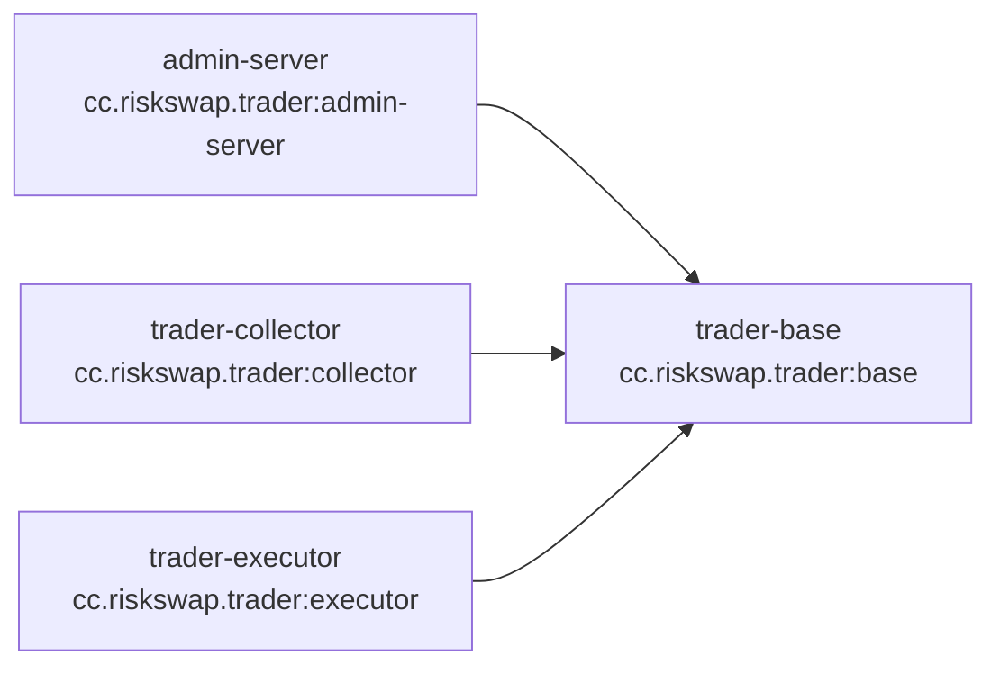
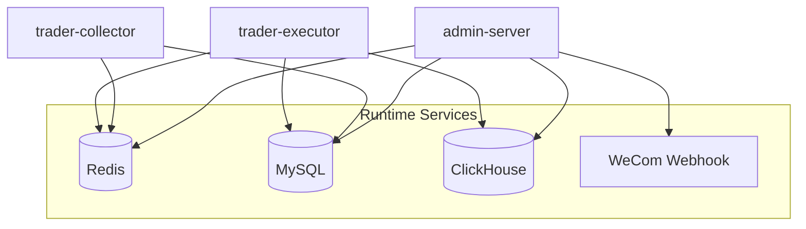

# 02 - 依赖关系

## Maven 模块依赖（代码级）

- `admin-server`：依赖 `base`，见 [admin-server/pom.xml](../../trader-admin/admin-server/pom.xml#L22-L27)
- `trader-collector`：依赖 `base`，见 [trader-collector/pom.xml](../../trader-collector/pom.xml#L32-L41)
- `trader-executor`：依赖 `base`，见 [trader-executor/pom.xml](../../trader-executor/pom.xml#L33-L39)

## 运行时依赖（服务级）

## 版本与兼容性提示

- Spring Boot：
  - `trader-base` / `trader-admin`：`3.5.6`（见 [trader-base/pom.xml](../../trader-base/pom.xml#L6-L11)，[trader-admin/pom.xml](../../trader-admin/pom.xml#L5-L10)）
  - `trader-collector` / `trader-executor`：`3.5.10`（见各自 `pom.xml`）
- Java：
  - `trader-base` / `trader-admin` / `trader-executor`：`java.version=21`
  - `trader-collector`：`java.version=17`（但 docker-compose 使用 `openjdk:21-jdk` 运行镜像；建议以实际 CI/运行环境为准）

## 前端依赖（admin-web）

- 依赖清单见 [admin-web/package.json](../../trader-admin/admin-web/package.json#L6-L27)
- 核心依赖：
  - Vue 3 + Vue Router 4
  - Element Plus
  - axios（HTTP）
  - echarts + vue-echarts（图表）
