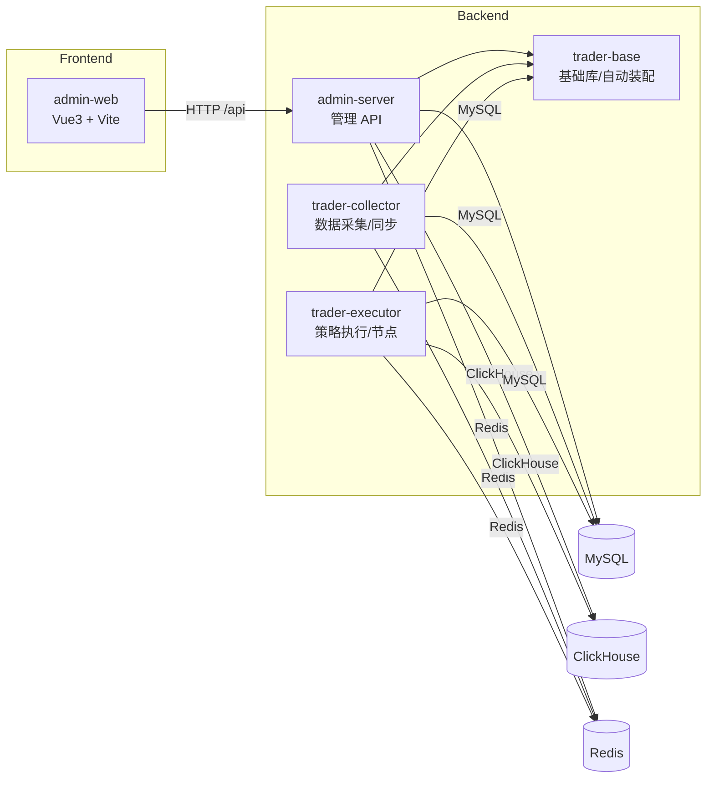

# Trader Code Wiki

本 Wiki 面向开发者，用于快速理解仓库整体架构、主要模块职责、关键类与函数、依赖关系与运行方式。文档以“代码结构”为主，功能视角的产品文档请参考 [product](../product/00功能模块.md) 等文件。

## 阅读导航

- [整体架构](../architecture/00-Architecture.md)
- [模块职责](../architecture/01-Modules.md)
- [依赖关系](../architecture/02-Dependency-Graph.md)
- [后端基础能力（trader-base）](./03-Backend-Core.md)
- [管理端后端（admin-server）](./04-Admin-Server.md)
- [采集服务（trader-collector）](./05-Collector.md)
- [执行服务（trader-executor）](./06-Executor.md)
- [管理端前端（admin-web）](./07-Admin-Web.md)
- [运行手册](../ops/08-Runbook.md)

## 项目概览

仓库包含多个 Spring Boot 服务 + 一个 Vue3 管理后台前端，其中 `trader-base` 作为可复用基础库（类似内部 starter）被其它服务依赖。

## 约定

- 文档中的源码引用使用仓库内可迁移的相对路径链接，避免依赖本机用户名与绝对路径。
- 配置示例会刻意避免在文档中扩散密码、token、webhook key 等敏感信息；请以环境变量或外部配置文件覆盖仓库默认值。
