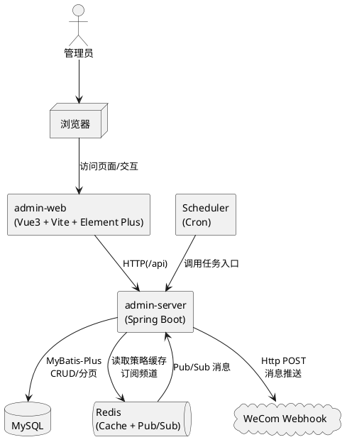
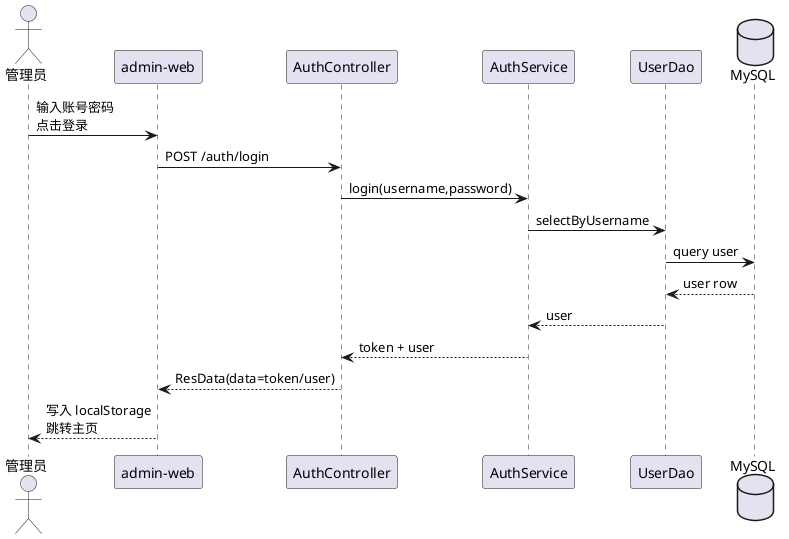
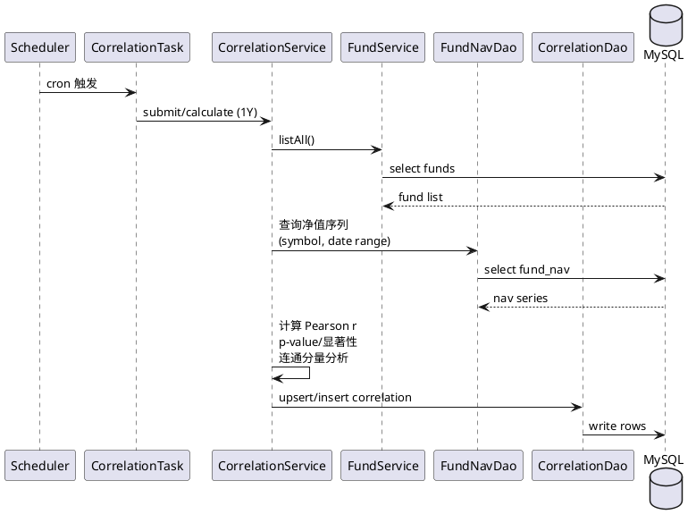

# Trader Admin 功能与模块说明

本文档基于当前代码仓库现状梳理 admin-web（前端）与 admin-server（后端）的功能模块、页面入口与主要接口，便于快速了解系统能力边界与调用方式。

## 项目结构

- admin-web：Vue 3 + Vite + Element Plus 管理端页面
- admin-server：Java Spring Boot 服务端，MVC 分层（Controller → Service → Dao），数据库访问使用 MyBatis-Plus

## 系统架构

### 逻辑分层

- 表现层：admin-web（页面路由、表格/表单交互、图表渲染）
- 接口层：admin-server Controller（参数校验与协议适配，统一 ResData(code/msg/data) 返回）
- 业务层：admin-server Service（业务编排、统计计算、通知组装）
- 数据层：admin-server Dao（MyBatis-Plus 访问 MySQL）
- 集成与异步：
  - Redis：策略信息缓存（Hash）、Pub/Sub（投资日志通知）
  - 企业微信机器人：消息推送
  - Spring Scheduler：定时任务（相关性计算）

### 组件关系图（PlantUML）



### 关键流程图（PlantUML）

#### 登录鉴权（用户名+密码）



#### 投资日志通知（Redis Pub/Sub → 企业微信）

```plantuml
@startuml
participant "外部系统" as Ext
queue "Redis Channel\ninvestment_log" as Redis
participant "InvestmentLogSubscriber" as Sub
participant "InvestmentLogService" as LogSvc
participant "WeComChannel" as WeComCh
database "MySQL" as MySQL
cloud "WeCom Webhook" as WeCom

Ext -> Redis : publish InvestmentMessage\n{id=investmentLogId}
Redis -> Sub : onMessage(payload)
Sub -> LogSvc : notifyInvestmentLog(investmentLogId)
LogSvc -> MySQL : 查询投资/日志/交易/持仓\n组装Markdown
LogSvc -> WeComCh : pushMarkdown(type,title,content)
WeComCh -> WeCom : HTTP POST /webhook/send
WeCom --> WeComCh : errcode/errmsg
WeComCh -> MySQL : insert msg_push_log\n(SUCCESS/FAIL)
LogSvc -> MySQL : update investment_log.notified=1
@enduml
```

#### 相关性定时计算（Scheduler → 统计分析落库）



## 前端（admin-web）

### 技术栈与约定

- Vue 3（Composition API）+ Vite
- Element Plus 组件库
- axios 统一请求封装（baseURL：VITE_API_BASE_URL || /api）
- ECharts：通过 vue-echarts 渲染图表（Dashboard、基金详情等）

相关文件：
- 路由入口：[index.ts](../../trader-admin/admin-web/src/router/index.ts)
- 布局与菜单：[MainLayout.vue](../../trader-admin/admin-web/src/layouts/MainLayout.vue)
- HTTP 封装：[http.ts](../../trader-admin/admin-web/src/services/http.ts)

### 页面与模块

#### 登录与权限

- 登录页：/login（用户名+密码登录；成功后写入 localStorage token 与 user）
  - 页面：[Login.vue](../../trader-admin/admin-web/src/pages/Login.vue)
  - 接口：POST /auth/login（见后端 AuthController）
- 路由守卫：未登录（localStorage 无 token）访问非 /login 会被重定向到 /login
  - 路由：[index.ts](../../trader-admin/admin-web/src/router/index.ts)

#### 主布局与通用能力

- 侧边栏模块：仪表盘、投资、交易所、ETF、公募基金、日志管理、统计分析、系统设置
- 顶部栏：折叠侧边栏、消息通知图标（红点）、用户下拉（修改密码/退出登录）
  - 布局：[MainLayout.vue](../../trader-admin/admin-web/src/layouts/MainLayout.vue)
  - 修改密码：POST /user/change-password

#### 仪表盘（Dashboard）

- 路由：/dashboard
- 功能：指标卡片（总资产/今日变动/持仓数量/风险指标）、近30天资产走势（折线图）、热门券商（Top5）、近期交易（Top5）、资产分布（环形饼图）
  - 页面：[Index.vue](../../trader-admin/admin-web/src/pages/dashboard/Index.vue)
  - 数据来源：
    - GET /dashboard/overview
    - GET /broker（分页取前 5 条）
    - GET /investment-trading/list（分页取前 5 条）

#### 投资模块

- 券商管理
  - 列表/新增/编辑/删除：/broker/list
    - 页面：[BrokerList.vue](../../trader-admin/admin-web/src/pages/investment/BrokerList.vue)
    - 接口：/broker（GET/POST/PUT/DELETE）
  - 详情：/broker/detail/:id
    - 页面：[BrokerDetail.vue](../../trader-admin/admin-web/src/pages/investment/BrokerDetail.vue)
    - 接口：GET /broker/{id}

- 投资计划（Investments）
  - 列表/搜索（名称/策略/预算/状态）+ 新增/编辑/删除 + 打开持仓抽屉：/investment/list
    - 页面：[List.vue](../../trader-admin/admin-web/src/pages/investment/List.vue)
    - 接口：/investments（GET/POST/PUT/DELETE/GET{id}）
    - 策略列表：GET /basic/strategies
    - 券商下拉：GET /broker（pageSize=200）
  - 详情（基础信息 + 最新持仓 + 最近10条日志）：/investment/detail/:id
    - 页面：[Detail.vue](../../trader-admin/admin-web/src/pages/investment/Detail.vue)

- 投资日志（资金记录）
  - 列表/筛选（类型、投资ID）+ 新增/编辑/删除：/investment/log
    - 页面：[LogList.vue](../../trader-admin/admin-web/src/pages/investment/LogList.vue)
    - 接口：/investment-logs（GET/POST/PUT/DELETE）

- 投资持仓
  - 列表/筛选（标的、投资ID）+ 新增/编辑/删除：作为独立页面 /investment/positions 以及投资详情/列表中的抽屉组件复用
  - 页面：[PositionList.vue](../../trader-admin/admin-web/src/pages/investment/PositionList.vue)
  - 接口：/investment-position（list/add/update/delete）

- 投资交易
  - 列表/筛选（代码）：/investment/trading
  - 页面：[TradingList.vue](../../trader-admin/admin-web/src/pages/investment/TradingList.vue)
  - 接口：GET /investment-trading/list

#### 交易所模块

- 交易所列表：/exchange/list（关键字查询）
  - 页面：[List.vue](../../trader-admin/admin-web/src/pages/exchange/List.vue)
  - 接口：GET /exchange/list
- 交易日历：/exchange/calendar（交易所+日期范围查询）
  - 页面：[CalendarList.vue](../../trader-admin/admin-web/src/pages/exchange/CalendarList.vue)
  - 接口：GET /calendar/list

#### ETF 基金模块（market = E）

- ETF基金列表：/etf/list（筛选、排序、编辑、删除、进入详情）
  - 页面：[List.vue](../../trader-admin/admin-web/src/pages/etf/List.vue)
  - 接口：POST /fund/list（前端固定 market=E）
- ETF详情：/etf/detail/:symbol（K线图）
  - 页面：[Detail.vue](../../trader-admin/admin-web/src/pages/etf/Detail.vue)
  - 接口：
    - GET /fund/detail/{symbol}
    - POST /fund/market（按 code + 日期范围拉取行情）
- ETF行情：/etf/market（行情列表；支持 code+日期范围查询，或分页浏览）
  - 页面：[MarketList.vue](../../trader-admin/admin-web/src/pages/etf/MarketList.vue)
  - 接口：POST /fund/market 或 POST /fund/market/list
- 复权因子：/etf/adj（复权因子列表；支持 code+日期范围查询，或分页浏览）
  - 页面：[AdjList.vue](../../trader-admin/admin-web/src/pages/etf/AdjList.vue)
  - 接口：POST /fund/adj 或 POST /fund/adj/list

#### 公募基金模块（market = O）

- 公募基金列表：/public/list（筛选、排序、编辑、删除、进入详情）
  - 页面：[List.vue](../../trader-admin/admin-web/src/pages/funds/List.vue)
  - 接口：POST /fund/list（前端固定 market=O）
- 基金详情：/funds/detail/:symbol（净值走势折线图）
  - 页面：[Detail.vue](../../trader-admin/admin-web/src/pages/funds/Detail.vue)
  - 接口：
    - GET /fund/detail/{symbol}
    - POST /fund-nav/list（按 symbol + 日期范围拉取净值序列）
- 基金净值列表：/public/nav（净值分页查询）
  - 页面：[NavList.vue](../../trader-admin/admin-web/src/pages/funds/NavList.vue)
  - 接口：POST /fund-nav/list

#### 日志管理

- 消息推送日志：/logs/push（筛选：类型、渠道、状态）
  - 页面：[PushList.vue](../../trader-admin/admin-web/src/pages/logs/PushList.vue)
  - 接口：GET /msg-push-log

#### 统计分析

- 相关性统计：/analysis/correlation（筛选：标的、相关标的、系数区间、周期）
  - 页面：[CorrelationList.vue](../../trader-admin/admin-web/src/pages/analysis/CorrelationList.vue)
  - 接口：GET /correlation

#### 系统设置

- /settings：占位页（暂未实现）
  - 页面：[Index.vue](../../trader-admin/admin-web/src/pages/settings/Index.vue)

#### 节点管理

- 节点管理：/node/list（执行节点与数据采集节点状态监控）

## 后端（admin-server）

### 架构概览

- Spring Boot + MVC 分层（Controller → Service → Dao）
- Dao 基于 MyBatis-Plus（部分 Dao 包含 pageQuery / listAll 等封装方法）
- 统一返回结构：ResData（code/msg/data）
- 异常处理：ExceptionAdvice + Warning

相关目录：
- Controller：[controller](../../trader-admin/admin-server/src/main/java/cc/riskswap/trader/admin/controller)
- Service：[service](../../trader-admin/admin-server/src/main/java/cc/riskswap/trader/admin/service)
- Dao：[dao](../../trader-admin/admin-server/src/main/java/cc/riskswap/trader/admin/dao)

### 主要接口（按模块）

#### 鉴权与用户

- 登录：POST /auth/login
  - Controller：[AuthController.java](../../trader-admin/admin-server/src/main/java/cc/riskswap/trader/admin/controller/AuthController.java)
- 修改密码：POST /user/change-password
  - Controller：[UserController.java](../../trader-admin/admin-server/src/main/java/cc/riskswap/trader/admin/controller/UserController.java)

#### 仪表盘

- 概览：GET /dashboard/overview
  - Controller：[DashboardController.java](../../trader-admin/admin-server/src/main/java/cc/riskswap/trader/admin/controller/DashboardController.java)
  - Service：[DashboardService.java](../../trader-admin/admin-server/src/main/java/cc/riskswap/trader/admin/service/DashboardService.java)

#### 投资与券商

- 券商：/broker
  - GET /broker（分页列表）
  - POST /broker（新增）
  - PUT /broker（更新）
  - DELETE /broker/{id}（删除）
  - GET /broker/{id}（详情）
  - Controller：[BrokerController.java](../../trader-admin/admin-server/src/main/java/cc/riskswap/trader/admin/controller/BrokerController.java)

- 投资计划：/investments
  - GET /investments（分页列表）
  - POST /investments（新增）
  - PUT /investments（更新）
  - DELETE /investments/{id}（删除）
  - GET /investments/{id}（详情）
  - Controller：[InvestmentController.java](../../trader-admin/admin-server/src/main/java/cc/riskswap/trader/admin/controller/InvestmentController.java)

- 投资日志：/investment-logs
  - GET /investment-logs（分页列表）
  - POST /investment-logs（新增）
  - PUT /investment-logs（更新）
  - DELETE /investment-logs/{id}（删除）
  - Controller：[InvestmentLogController.java](../../trader-admin/admin-server/src/main/java/cc/riskswap/trader/admin/controller/InvestmentLogController.java)

- 投资持仓：/investment-position
  - GET /investment-position/list
  - POST /investment-position/add
  - POST /investment-position/update
  - POST /investment-position/delete
  - Controller：[InvestmentPositionController.java](../../trader-admin/admin-server/src/main/java/cc/riskswap/trader/admin/controller/InvestmentPositionController.java)

- 投资交易：/investment-trading
  - GET /investment-trading/list
  - Controller：[InvestmentTradingController.java](../../trader-admin/admin-server/src/main/java/cc/riskswap/trader/admin/controller/InvestmentTradingController.java)

#### 交易所与交易日历

- 交易所列表：GET /exchange/list
  - Controller：[ExchangeController.java](../../trader-admin/admin-server/src/main/java/cc/riskswap/trader/admin/controller/ExchangeController.java)
- 交易日历列表：GET /calendar/list
  - Controller：[CalendarController.java](../../trader-admin/admin-server/src/main/java/cc/riskswap/trader/admin/controller/CalendarController.java)

#### 基金（ETF/公募共用）

- 基金分页：POST /fund/list
- 基金详情：GET /fund/detail/{symbol}
- 基金更新：PUT /fund/update/{symbol}
- 基金删除：DELETE /fund/delete/{symbol}
- 基金行情：POST /fund/market
- 复权因子：POST /fund/adj
- 默认代码：GET /fund/default-code
- 行情分页：POST /fund/market/list
- 复权分页：POST /fund/adj/list
  - Controller：[FundController.java](../../trader-admin/admin-server/src/main/java/cc/riskswap/trader/admin/controller/FundController.java)

- 基金净值分页：POST /fund-nav/list
  - Controller：[FundNavController.java](../../trader-admin/admin-server/src/main/java/cc/riskswap/trader/admin/controller/FundNavController.java)

#### 基础数据

- 策略列表：GET /basic/strategies
- 标的搜索：GET /basic/symbols（目前支持 FUND/ETF）
  - Controller：[BasicController.java](../../trader-admin/admin-server/src/main/java/cc/riskswap/trader/admin/controller/BasicController.java)

#### 统计分析：相关性

- 相关性分页：GET /correlation
- 相关性计算：POST /correlation/calculate
- 相关性新增：POST /correlation
- 相关性更新：PUT /correlation
- 相关性删除：DELETE /correlation/{id}
  - Controller：[CorrelationController.java](../../trader-admin/admin-server/src/main/java/cc/riskswap/trader/admin/controller/CorrelationController.java)

#### 日志：消息推送

- 推送日志分页：GET /msg-push-log
- 发送推送：POST /msg-push-log/send
  - Controller：[MsgPushLogController.java](../../trader-admin/admin-server/src/main/java/cc/riskswap/trader/admin/controller/MsgPushLogController.java)

### 定时任务

- 证券相关性计算：每天 02:00 对基金全量两两组合提交 1Y 周期计算任务
  - 任务：[CorrelationTask.java](../../trader-admin/admin-server/src/main/java/cc/riskswap/trader/admin/task/CorrelationTask.java)
- FundTask：已注册为组件并启用调度，但当前无具体任务逻辑
  - 任务：[FundTask.java](../../trader-admin/admin-server/src/main/java/cc/riskswap/trader/admin/task/FundTask.java)

## 启动与配置

### 本地启动（前端）

- 开发启动：在 admin-web 目录执行 npm run dev（默认端口 5173）
- 构建产物：npm run build（输出到 admin-web/dist）
- 本地代理：Vite 将 /api 代理到 http://localhost:8080，并重写去掉 /api 前缀
  - 配置：[vite.config.ts](../../trader-admin/admin-web/vite.config.ts)

### 本地启动（后端）

- Java 版本：21（根 POM 指定）
  - 配置：[pom.xml](../../trader-admin/pom.xml)
- 服务端端口：8080
- Spring Profile：默认 active=dev
  - 配置：[application.yml](../../trader-admin/admin-server/src/main/resources/application.yml)

### 配置项（后端）

application.yml 使用环境变量覆盖的关键项：

- MySQL：
  - trader.mysql.url
  - trader.mysql.username
  - trader.mysql.password
- Redis：
  - trader.redis.host
  - trader.redis.port
  - trader.redis.password
  - trader.redis.database
- 企业微信 Webhook：
  - WECOM_WEBHOOK_URL

### 数据库初始化

- Spring SQL 初始化：spring.sql.init.mode=always
- SQL 文件：
  - [schema.sql](../../trader-admin/admin-server/src/main/resources/schema.sql)
  - [db.sql](../../trader-admin/admin-server/src/main/resources/database/db.sql)
