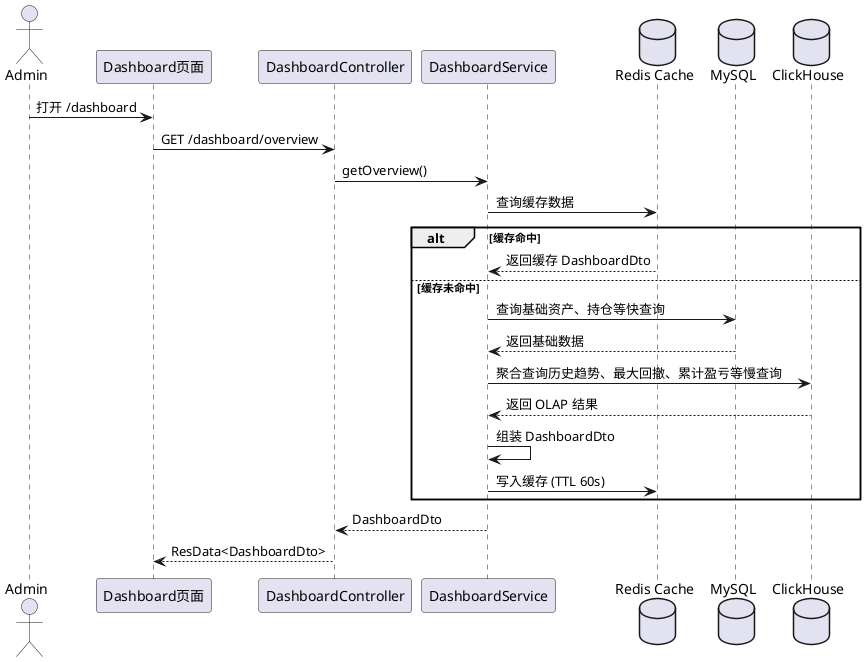

# 模块：仪表盘

## 目标与范围

仪表盘是管理端首页的经营与资产总览页面，目标是用一屏视图回答以下核心问题：

- 当前总资产规模是多少，包含哪些资产类别（券商现金、投资资产、基金资产等）
- 今日及累计的资产变化与盈亏情况如何
- 近期资产趋势、资产结构与交易活跃度如何
- 核心交易策略的表现（胜率、最大回撤等）
- 当前系统核心组件（Redis、ClickHouse等）的运行状态如何

当前范围聚焦于“展示”，不包含在仪表盘内直接执行交易、调仓、策略控制等写操作。

## 需求详细设计

### 业务目标

- 为管理员提供日常巡检入口，减少跨页面查询成本
- 提供可解释的资产口径（总资产=券商现金+投资资产+基金资产）
- 提供近 30 天趋势与结构分布，支持快速识别异常波动
- 提供核心交易指标（盈亏、胜率、回撤）以评估策略有效性
- 提供系统健康度概览，保障交易系统稳定运行

### 功能需求

- 指标卡片（核心财务与风险指标）
  - 资产总览：货币格式展示总资产
  - 今日变动：今日整体盈亏（红涨绿跌样式）
  - 累计盈亏：历史累计利润汇总
  - 胜率：盈利交易/总交易的占比
  - 最大回撤：近30天（或全周期）资产曲线的最大回撤率
  - 持仓数量：当前实现口径为 RUNNING 状态投资数量
- 资产走势图
  - 时间窗口：近 30 天（含当天）
  - 粒度：日
  - 曲线：总资产单条折线，带面积渐变，可叠加对比基准收益率
- 资产分布图
  - 维度：Cash (Broker) + 投资类型 (如 Crypto, Stock, Fund) 分组
  - 图形：环形饼图
- 系统运行状态
  - 监控项：Redis 缓存连接、ClickHouse 数据库状态、MySQL 主库状态
  - 样式：状态指示灯（绿/黄/红）
- 热门券商
  - 数据来源：`/broker` 分页前 5 条
  - 字段：name/code/currentCapital
- 近期交易
  - 数据来源：`/investment-trading/list` 分页前 5 条
  - 字段：symbol/type/price/volume/amount

### 非功能需求

- 首屏数据并发加载，减少等待
- 接口失败不阻塞其他模块展示
- 响应式布局兼容移动端与桌面端
- 金额展示统一两位小数和人民币符号
- Dashboard 数据需具备一定实时性，关键聚合计算考虑缓存优化

## 前端设计（admin-web）

### 页面入口

- 路由：`/dashboard`
- 页面实现：`Index.vue`

### 组件与布局

- 顶部第一排：核心资产与盈亏指标（`el-row + el-col + el-card`，如总资产、今日变动、累计盈亏）
- 顶部第二排：交易与风险指标及系统状态（如胜率、最大回撤、持仓数、系统状态灯）
- 中部：
  - 左：资产走势（`vue-echarts` 折线）
  - 右：资产分布环图（`vue-echarts` 饼图）
- 底部：
  - 左：近期交易表格
  - 右：热门券商列表

### 前端数据模型

- 类型定义：`dashboard.ts` 扩展
  - `totalAsset`, `todayChange`, `totalProfit`
  - `winRate`, `maxDrawdown`, `holdingCount`
  - `systemStatus` (Redis, ClickHouse, MySQL 的健康状态)
  - `assetTrend[]`（label/value）
  - `assetDistribution[]`（label/value）

### 数据加载流程

- 页面 `onMounted` 调用 `loadAllData`
- 使用 `Promise.all` 并发请求：
  - `GET /dashboard/overview`
  - `GET /dashboard/system-status` (新增)
  - `GET /broker?pageNo=1&pageSize=5`
  - `GET /investment-trading/list?pageNo=1&pageSize=5`
- 成功后分别写入对应状态变量，图表 option 通过 `computed` 自动更新

## 后端设计（admin-server）

### 分层与职责

- Controller：`DashboardController.java`
  - 暴露 `GET /dashboard/overview`，返回 `ResData<DashboardDto>`
  - 暴露 `GET /dashboard/system-status`，返回系统组件健康度
- Service：`DashboardService.java`
  - 负责指标聚合、趋势计算、分布计算，集成 Redis 缓存
- Dao：
  - BrokerDao, InvestmentDao, InvestmentLogDao

### 接口契约与 DTO 变更

- 扩展 `DashboardDto.java`：
  - 增加 `totalProfit` (累计盈亏)
  - 增加 `winRate` (胜率)
  - 增加 `maxDrawdown` (最大回撤)
- 新增 `SystemStatusDto.java`：
  - 包含 `redisStatus`, `clickHouseStatus`, `mysqlStatus`

### 核心计算口径

- 总资产
  - `broker.current_capital` + `investment` 最新日志资产 + 基金资产 (Fund)
- 盈亏相关
  - 今日变动：今日所有日志 `profit` 之和
  - 累计盈亏：全量 `investment_log.profit` 之和
  - 胜率：`(profit > 0 的日志数) / (总日志数)` 或按平仓单计算
  - 最大回撤：根据历史总资产序列计算 `(峰值-谷值)/峰值` 的最大值
- 资产分布
  - 扩展投资维度：增加对基金(Fund)类资产的单列统计
- 系统状态
  - 探测各组件的 ping 或连接有效性

## 性能优化方案（Redis & ClickHouse）

当前实现基于 MySQL 内存聚合，随着 `investment_log` 增多，面临性能瓶颈。需实施以下优化：

1. **Redis 缓存层**
   - 场景：Dashboard 概览数据访问频次高，且对绝对实时性要求可容忍秒级延迟。
   - 方案：将 `DashboardDto` 的计算结果序列化存入 Redis，设置 30-60 秒过期时间。对于总资产、分布图等大盘数据优先从缓存读取，后台定时任务或数据更新事件主动刷新缓存。
2. **ClickHouse 降级与 OLAP 分析**
   - 场景：海量交易流水、每日资产快照的聚合计算（如资产走势、累计盈亏、最大回撤）。
   - 方案：
     - 将 MySQL 中的 `investment_log` 和交易订单数据异步同步至 ClickHouse（如使用 Materialized View 或同步任务）。
     - 仪表盘的“近30天资产走势”和“复杂风险指标（回撤、胜率）”改为查询 ClickHouse。利用 ClickHouse 强大的列式聚合能力（如 `argMax`, `window functions`），将应用层的内存计算下推至数据库执行。
3. **接口解耦**
   - 慢查询（如最大回撤、30天趋势）与快查询（当前总资产、持仓数）分拆为不同接口或采用异步并发加载，避免木桶效应导致整个仪表盘响应缓慢。

## 关键流程更新（PlantUML）

## 验收标准

- 打开 `/dashboard` 后可见完整的核心指标卡片（含盈亏、胜率、回撤）、系统状态灯、图表及列表。
- 资产走势图、分布图能够准确反映包含“基金(Fund)”在内的各类资产。
- 系统状态指示灯能正确反映组件宕机（如停止 Redis 后显示红色）。
- 后端具备 Redis 缓存机制，连续刷新页面接口响应时间 < 50ms。
- 移动端断点下卡片布局可正常换行与展示。
